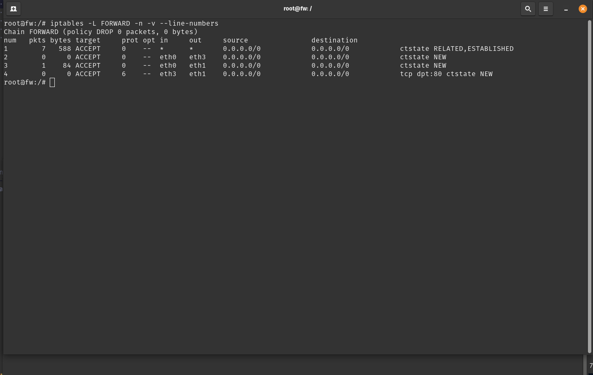
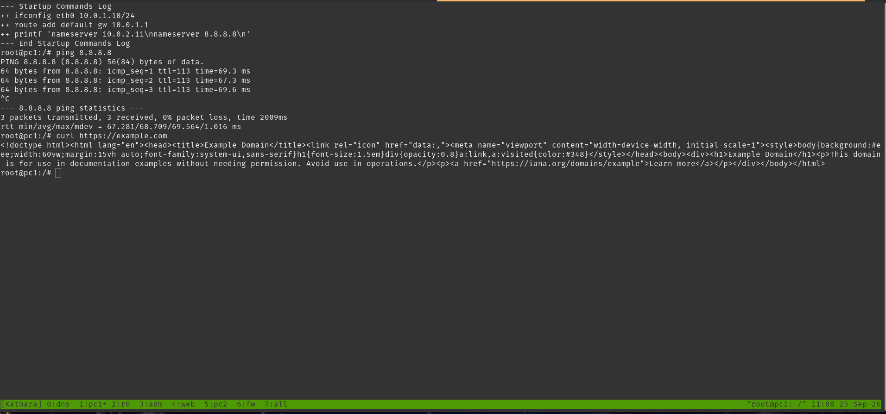
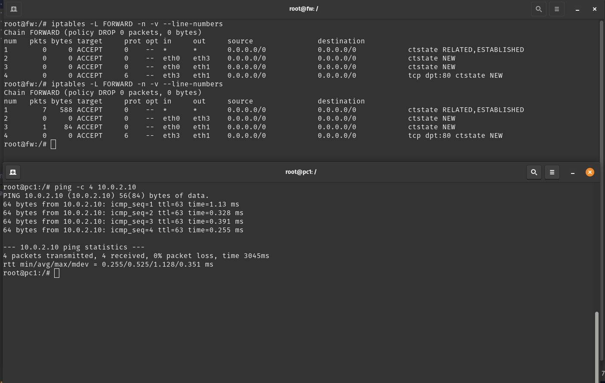
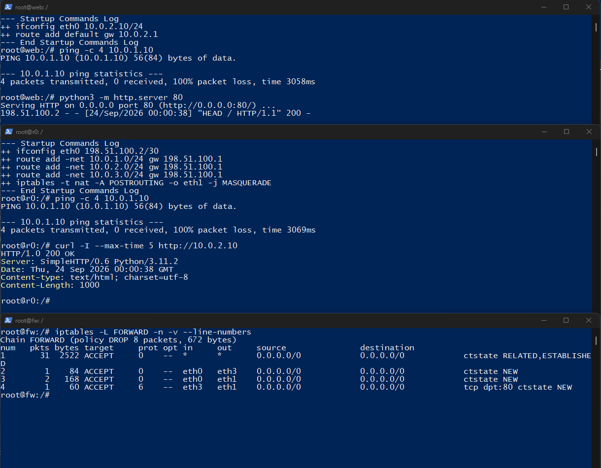
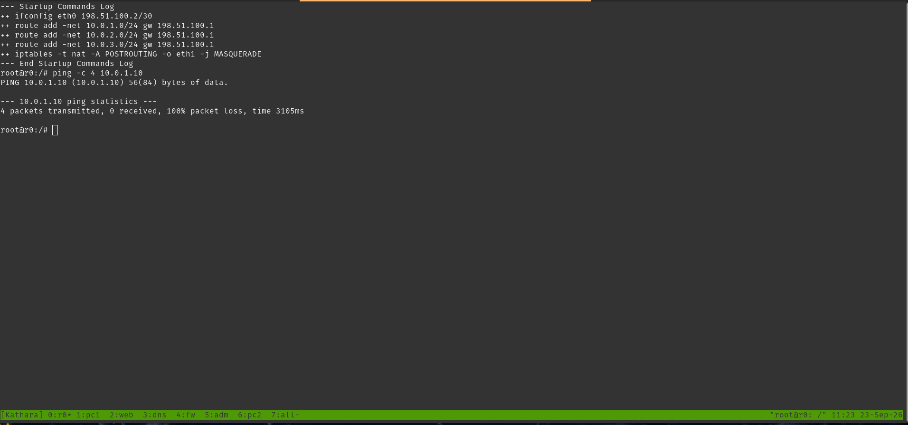

# Evidências — Firewall de Perímetro

## 1. Objetivo

Implementar a segurança de perímetro no nó `fw` da topologia Kathará utilizando
`iptables`, adotando filtragem stateful e o princípio de bloqueio por padrão.

A política aplicada foi:

- LAN → Internet: permitir
- LAN → DMZ: permitir
- Internet → Web da DMZ: permitir
- Internet → LAN: bloquear
- DMZ → LAN: bloquear novas conexões
- Respostas de conexões permitidas: permitir
- Demais tráfegos encaminhados: bloquear pela política padrão `DROP`

---

## 2. Configuração verificada

No firewall `fw`, foi utilizada a cadeia `FORWARD`, pois os tráfegos entre
LAN, DMZ e WAN são encaminhados pelo firewall.

A política padrão foi configurada como:

```bash
iptables -P FORWARD DROP
```

Regra para permitir respostas de conexões já estabelecidas:

```bash
iptables -A FORWARD -m conntrack --ctstate ESTABLISHED,RELATED -j ACCEPT
```

Essa regra permite que respostas retornem para conexões que foram iniciadas
por uma rede autorizada, sem permitir novas conexões arbitrárias no sentido
contrário.

Regras de acesso:

```bash
iptables -A FORWARD -i eth0 -o eth3   -m conntrack --ctstate NEW -j ACCEPT

iptables -A FORWARD -i eth0 -o eth1   -m conntrack --ctstate NEW -j ACCEPT

iptables -A FORWARD -i eth3 -o eth1   -p tcp --dport 80   -m conntrack --ctstate NEW -j ACCEPT
```

Mapeamento das interfaces:

- `eth0` → LAN (`10.0.1.0/24`)
- `eth1` → DMZ (`10.0.2.0/24`)
- `eth2` → MGMT (`10.0.3.0/24`)
- `eth3` → WAN (`198.51.100.0/30`)

---

## 3. Evidência da política padrão

Comando utilizado no `fw`:

```bash
iptables -L FORWARD -n -v --line-numbers
```

A cadeia `FORWARD` está com política `DROP` e somente quatro regras de
`ACCEPT`. Nessa captura, o contador da política ainda estava em 0 pacotes:
os testes de bloqueio foram feitos depois.



Somente os tráfegos que casam com uma dessas regras atravessam o firewall.

---

## 4. Evidência — LAN → DMZ

No `pc1` (`10.0.1.10`), a LAN alcançou os dois hosts da DMZ:

```bash
ping -c 4 10.0.2.10
ping -c 4 10.0.2.11
```

Os dois testes receberam 4 respostas e terminaram com 0% de perda. O
`10.0.2.10` é o `web` e o `10.0.2.11` é o `dns`.

.png>)

A regra correspondente é a de sessão nova da LAN para a DMZ:

```text
eth0 → eth1   ctstate NEW
```

Na verificação dos contadores, essa regra registrou o primeiro pacote da
conversa:

```text
3        1    84  ACCEPT  ... eth0  eth1 ... ctstate NEW
```

O acesso ao `dns` foi comprovado por alcance ICMP ao host. Não houve consulta
de nome, porque o `dns.startup` só configura o endereço IP.

---

## 5. Evidência — LAN → Internet

No `pc1`:

```bash
ping 8.8.8.8
curl https://example.com
```

O `ping` terminou com 0% de perda (3 pacotes enviados e 3 recebidos). O
`curl` recebeu o HTML de `example.com`.



A regra correspondente é:

```text
eth0 → eth3   ctstate NEW
```

No estado final do firewall, essa regra aparece com 1 pacote e 84 bytes. O
primeiro pacote da sessão entra como `NEW`; o restante do `ping` e o `curl`
seguem pela regra `ESTABLISHED,RELATED`.

---

## 6. Evidência — Respostas de conexões permitidas

Foi comparada a contagem de pacotes antes e depois do `ping` do `pc1` para
`10.0.2.10`.

### Antes

```text
1        0     0  ACCEPT  ... ctstate RELATED,ESTABLISHED
3        0     0  ACCEPT  ... eth0  eth1 ... ctstate NEW
```

### Depois

```text
1        7   588  ACCEPT  ... ctstate RELATED,ESTABLISHED
3        1    84  ACCEPT  ... eth0  eth1 ... ctstate NEW
```

A regra `ESTABLISHED,RELATED` passou de 0 para 7 pacotes e 588 bytes. O
`ping` no `pc1` recebeu as 4 respostas (0% de perda).



O filtro é stateful: depois que a LAN abre a conexão, o `conntrack` classifica
os pacotes de volta como `ESTABLISHED` ou `RELATED` e a regra 1 os aceita.
Não existe regra genérica permitindo novas conexões da DMZ para a LAN.

---

## 7. Evidência — Internet → Web da DMZ

A política só libera sessão nova vinda da WAN quando o destino é TCP/80 na
DMZ:

```bash
iptables -A FORWARD -i eth3 -o eth1 -p tcp --dport 80 -m conntrack --ctstate NEW -j ACCEPT
```

No `web` foi iniciado um servidor HTTP temporário, porque o `web.startup` só
configura o IP:

```bash
python3 -m http.server 80
```

No `r0` (`198.51.100.2`):

```bash
curl -I --max-time 5 http://10.0.2.10
```

O resultado foi `HTTP/1.0 200 OK`. O log do `web` registrou
`HEAD / HTTP/1.1` com status 200, originado em `198.51.100.2`.

No `fw`, a regra 4 saiu de 0 e passou a 1 pacote e 60 bytes:

```text
4        1    60  ACCEPT  ... eth3  eth1 ... tcp dpt:80 ctstate NEW
```



---

## 8. Evidência — Internet → LAN

Não existe regra `NEW` para `eth3 → eth0`. No `r0`:

```bash
ping -c 4 10.0.1.10
```

O resultado foi 4 pacotes enviados, 0 recebidos e 100% de perda.



O mesmo teste aparece de novo no topo do terminal do `r0` em
`internet-web.png`. Esses pacotes caem na política `DROP`.

---

## 9. Evidência — DMZ → LAN

Não existe regra `NEW` para `eth1 → eth0`. No `web`:

```bash
ping -c 4 10.0.1.10
```

O resultado foi 4 pacotes enviados, 0 recebidos e 100% de perda.

-lan(pc1).png>)

A regra `ESTABLISHED,RELATED` não abre esse caminho. Ela só devolve tráfego
de uma conexão que já foi autorizada, como a resposta a um acesso iniciado
pela LAN.

---

## 10. Estado final do firewall

Depois dos testes de bloqueio e do HTTP a partir do `r0`, a cadeia `FORWARD`
no `fw` ficou assim:

```text
Chain FORWARD (policy DROP 8 packets, 672 bytes)
num   pkts bytes target   prot  in    out    observação
1       31  2522 ACCEPT   all   *     *      ctstate RELATED,ESTABLISHED
2        1    84 ACCEPT   all   eth0  eth3   ctstate NEW
3        2   168 ACCEPT   all   eth0  eth1   ctstate NEW
4        1    60 ACCEPT   tcp   eth3  eth1   tcp dpt:80 ctstate NEW
```

Os 8 pacotes e 672 bytes da política `DROP` coincidem com os dois pings
bloqueados de 4 pacotes cada um (Internet → LAN e DMZ → LAN). As quatro
regras de `ACCEPT` têm contador maior que zero: respostas, LAN → Internet,
LAN → DMZ e Internet → Web na porta 80.

A listagem completa está na parte de baixo de `internet-web.png`.

---

## 11. Conclusão

A configuração implementa um firewall de perímetro com política padrão
`DROP` na cadeia `FORWARD` e libera explicitamente os fluxos necessários.

Os testes e contadores do `iptables` demonstram:

1. A política padrão de bloqueio está ativa e, ao final, contabilizou os
   pacotes descartados.
2. O tráfego LAN → DMZ foi permitido, com `ping` do `pc1` para `web` e `dns`.
3. O tráfego LAN → Internet foi permitido, com `ping` para `8.8.8.8` e
   `curl` para `example.com`.
4. As respostas de conexões permitidas foram aceitas por
   `ESTABLISHED,RELATED`.
5. O `r0` obteve `HTTP 200` no `web` da DMZ, e a regra TCP/80 registrou o
   pacote.
6. O `ping` do `r0` para o `pc1` foi bloqueado.
7. O `ping` do `web` para o `pc1` foi bloqueado.
