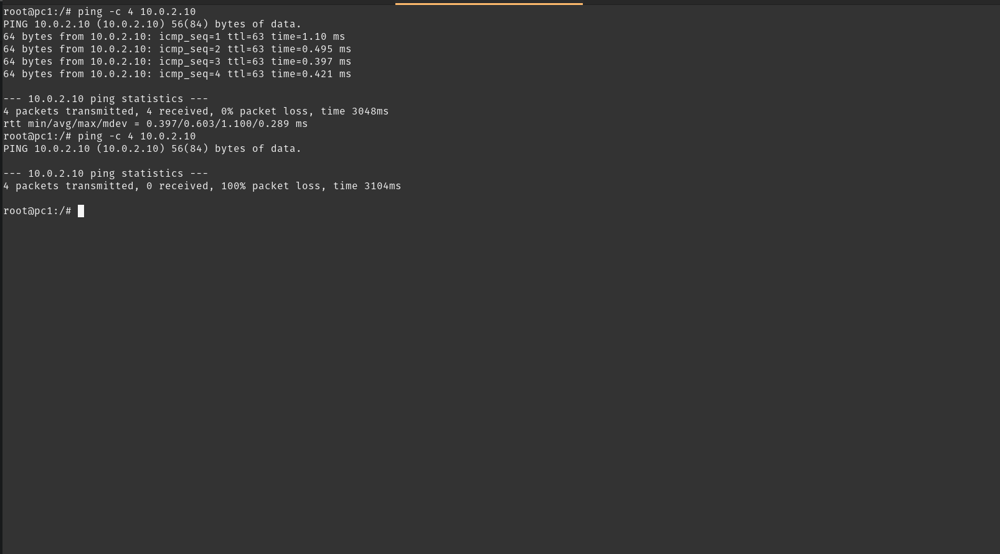
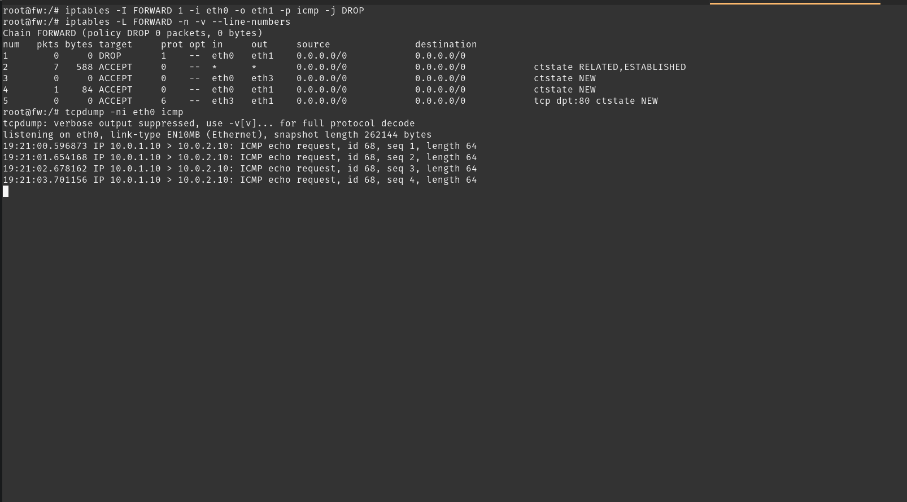
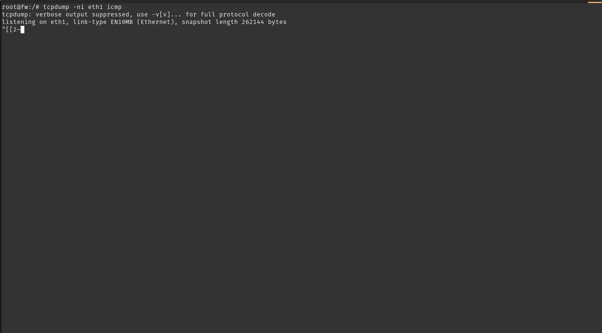
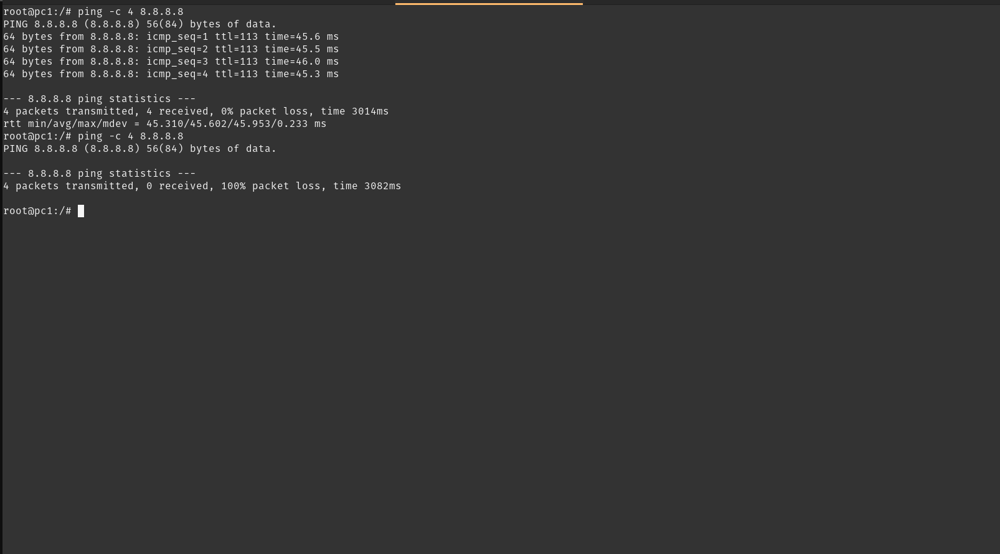
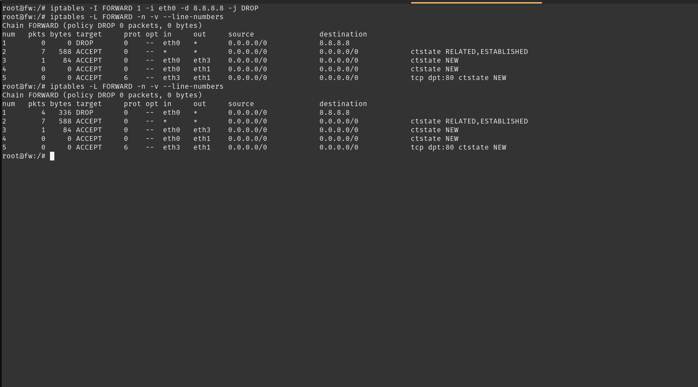
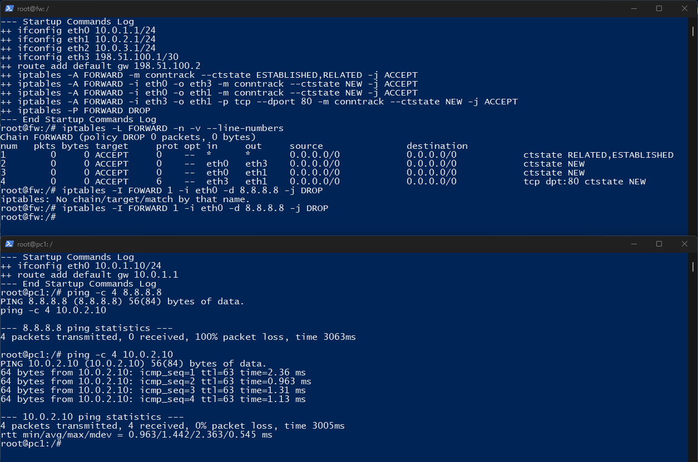

# Relatório de Evidências — Controles em Camada 3 (L3)

**Objetivo:** Implementar e validar regras de firewall baseadas no protocolo ICMP e no endereço IP de destino, demonstrando o efeito com `ping` e `tcpdump`.

As regras deste experimento foram inseridas ao vivo com `iptables -I`. Elas não estão no `fw.startup`. Ao recriar o laboratório, só a política de perímetro volta a existir.

---

## Experimento A — Bloqueio de ICMP

### 1. Antes da regra

No `pc1` (`10.0.1.10`):

```bash
ping -c 4 10.0.2.10
```

O `web` respondeu aos 4 pacotes, com 0% de perda. Nessa hora a política de perímetro ainda aceitava ICMP novo da LAN para a DMZ (`eth0 → eth1`).

### 2. Regra

No `fw`, a regra entrou no topo da cadeia `FORWARD`, antes dos `ACCEPT` do perímetro:

```bash
iptables -I FORWARD 1 -i eth0 -o eth1 -p icmp -j DROP
iptables -L FORWARD -n -v --line-numbers
```

A listagem mostrou a regra 1 como `DROP` de ICMP em `eth0 → eth1`. O contador ainda estava em 0 porque essa consulta foi feita antes do `ping` bloqueado.

### 3. Depois da regra

No `fw`, em dois terminais:

```bash
tcpdump -ni eth0 icmp
tcpdump -ni eth1 icmp
```

No `pc1`:

```bash
ping -c 4 10.0.2.10
```

O segundo `ping` enviou 4 pacotes, recebeu 0 e terminou com 100% de perda.



O `tcpdump` na `eth0` registrou os quatro `ICMP echo request` de `10.0.1.10` para `10.0.2.10`. O `tcpdump` na `eth1` não registrou nenhum pacote.





O pacote chega pela LAN, casa com a regra 1 e é descartado dentro do `fw`. A DMZ não recebe o echo request e por isso não há echo reply.

### 4. Respostas da investigação

**O que acontece com o pacote ICMP?** O echo request sai do `pc1` e entra no `fw` pela `eth0`. A regra de ICMP o descarta. O `pc1` não recebe resposta e o `ping` contabiliza perda total.

**Em que ponto o firewall interfere?** Na cadeia `FORWARD`, entre a interface de entrada da LAN (`eth0`) e a interface de saída da DMZ (`eth1`). A captura na `eth0` vê o pacote. A captura na `eth1` não vê. O descarte ocorre antes do encaminhamento para a DMZ.

**Qual a diferença entre permitir e bloquear?** Sem a regra, o ICMP novo da LAN para a DMZ casa com o `ACCEPT` de `eth0 → eth1` e a resposta volta por `ESTABLISHED,RELATED`. Com a regra no topo, só o ICMP nesse sentido é descartado. A regra não cobre outros protocolos nem o ICMP que sai pela `eth3` em direção à Internet.

---

## Experimento B — Bloqueio por IP de destino

O destino escolhido foi `8.8.8.8`, como recurso externo proibido. A regra de ICMP do experimento A não estava mais na tabela.

### 1. Antes da regra

No `pc1`:

```bash
ping -c 4 8.8.8.8
```

Os 4 pacotes foram recebidos, com 0% de perda.

### 2. Regra

No `fw`:

```bash
iptables -I FORWARD 1 -i eth0 -d 8.8.8.8 -j DROP
```

Qualquer protocolo vindo da LAN com esse destino é descartado. Os demais destinos continuam nas regras de perímetro.

### 3. Depois da regra

No `pc1`:

```bash
ping -c 4 8.8.8.8
```

O segundo `ping` enviou 4 pacotes, recebeu 0 e terminou com 100% de perda.



No `fw`, a mesma regra passou de 0 para 4 pacotes e 336 bytes:

```text
1    4   336  DROP  ... eth0  *  destination 8.8.8.8
```



### 4. Isolamento do bloqueio

Com a regra de `8.8.8.8` ainda ativa, no `pc1`:

```bash
ping -c 4 10.0.2.10
```

Esse destino não casa com `-d 8.8.8.8`. O pacote segue para a permissão LAN → DMZ e o `web` responde.



O bloqueio é o endereço de destino, não a saída da LAN para a Internet nem o acesso à DMZ.

### 5. Por que bloquear um IP não impede um site

Bloquear `8.8.8.8` impede aquele endereço. Um site real não é um único IP.

- Um domínio pode ter muitos endereços ao mesmo tempo, por DNS round robin, anycast ou vários servidores.
- Esses endereços mudam. Uma alteração de DNS deixa a regra obsoleta.
- Uma CDN, como Cloudflare ou Akamai, troca o IP da borda e vários clientes compartilham os mesmos endereços.
- Vários sites podem estar no mesmo IP, por hospedagem compartilhada e nome indicado no HTTP ou no TLS (SNI). Bloquear o IP de um serviço também bloqueia os outros que usam esse endereço.

Por isso o controle de um site pelo nome pede inspeção de camada de aplicação, como filtro de DNS, proxy HTTP/HTTPS ou um firewall de próxima geração. Isso fica fora da implementação desta task.
