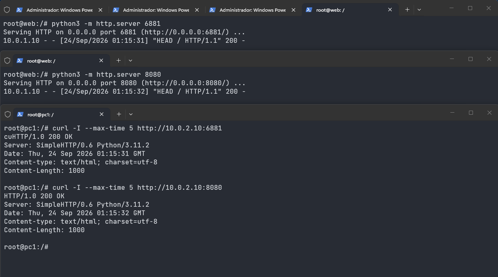
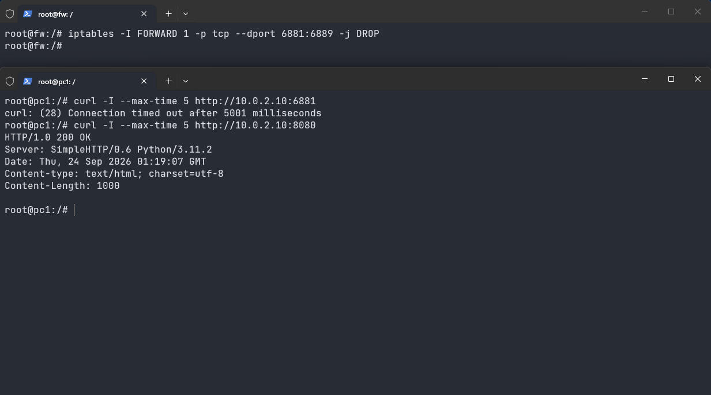
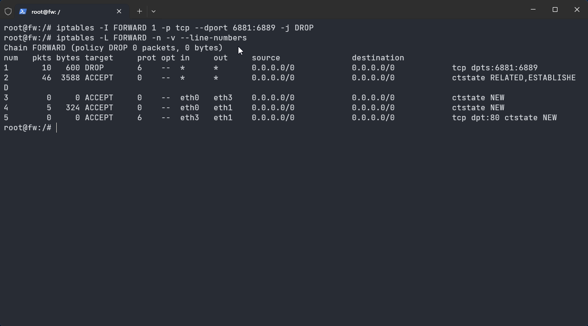

# Relatório de Evidências — Bloqueio em Camada 4 (TCP/UDP)

**Objetivo:** Bloquear um intervalo de portas TCP no firewall e verificar que só esse intervalo deixa de passar. O intervalo escolhido é `6881:6889`, a faixa TCP antiga padrão do BitTorrent.

A regra foi inserida ao vivo com `iptables -I`. Ela não faz parte do `fw.startup`.

O `web` não sobe nenhum serviço sozinho. Para ter o que testar, dois servidores HTTP temporários escutam na DMZ:

- `10.0.2.10:6881`, dentro da faixa bloqueada
- `10.0.2.10:8080`, fora da faixa, para mostrar que o restante continua permitido

---

## 1. Antes da regra

No `web`:

```bash
python3 -m http.server 6881
python3 -m http.server 8080
```

No `pc1`:

```bash
curl -I --max-time 5 http://10.0.2.10:6881
curl -I --max-time 5 http://10.0.2.10:8080
```

As duas portas respondem `HTTP/1.0 200 OK`. A política de perímetro aceita sessão nova da LAN para a DMZ em qualquer protocolo e porta.



## 2. Regra

No `fw`, a regra entra no topo da cadeia `FORWARD`, antes do `ACCEPT` da LAN para a DMZ:

```bash
iptables -I FORWARD 1 -p tcp --dport 6881:6889 -j DROP
```

Ela descarta TCP cujo destino esteja entre 6881 e 6889, inclusive. UDP, outras portas TCP e o servidor na porta 8080 não casam com essa regra.

## 3. Depois da regra

No `pc1`:

```bash
curl -I --max-time 5 http://10.0.2.10:6881
curl -I --max-time 5 http://10.0.2.10:8080
```

A porta 6881 não devolve status HTTP. O `curl` encerra por tempo esgotado: o `fw` descarta o SYN e não envia recusa, então o cliente espera até `--max-time 5`. A porta 8080 continua respondendo `HTTP/1.0 200 OK`.



No `fw`, o contador da regra 1 sai de zero depois da tentativa na porta 6881:

```bash
iptables -L FORWARD -n -v --line-numbers
```



## 4. Bloquear portas não impede o BitTorrent

A regra cumpre o que ela diz: TCP destinado às portas 6881–6889 não atravessa o firewall. Isso não impede uma aplicação como o BitTorrent.

- O cliente pode usar outra porta TCP. A faixa 6881–6889 é só o padrão antigo. O print da porta 8080 mostra o mesmo efeito: o que está fora do intervalo passa.
- As portas de dados são dinâmicas. Cada par escolhe portas altas na hora da conexão, então uma lista fixa não cobre as sessões seguintes.
- O BitTorrent também fala UDP, no transporte uTP. Esta regra é `-p tcp`. O UDP das mesmas portas não casa com ela.
- O tráfego pode sair por 80 ou 443, portas que a política de perímetro deixa passar, ou usar ofuscação para não parecer BitTorrent.

Filtrar a porta identifica o transporte, não a aplicação. Conter o BitTorrent pelo comportamento pede inspeção de camada de aplicação, como um firewall de próxima geração ou um controle no proxy. Isso não é implementado nesta task.
